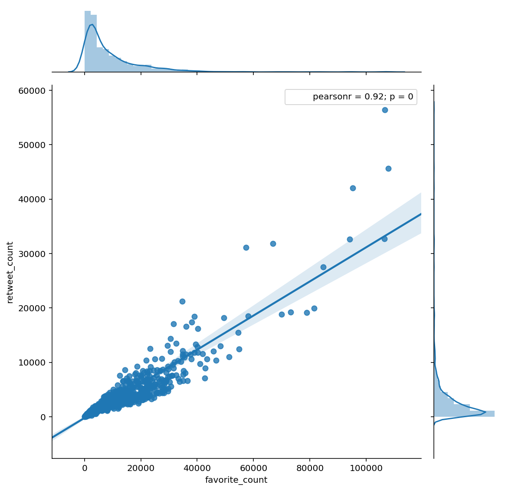
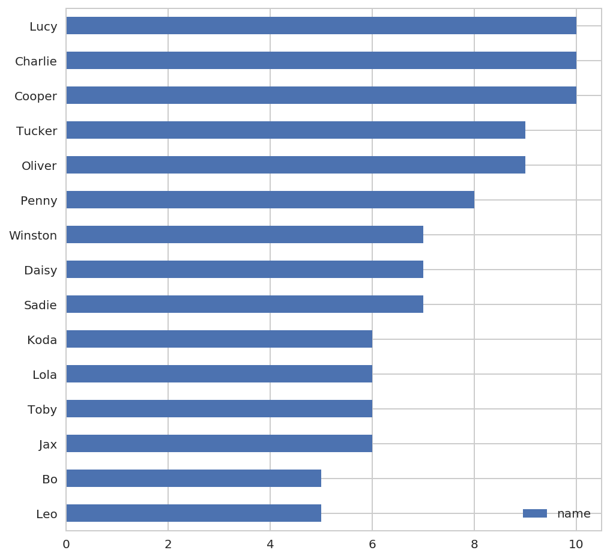
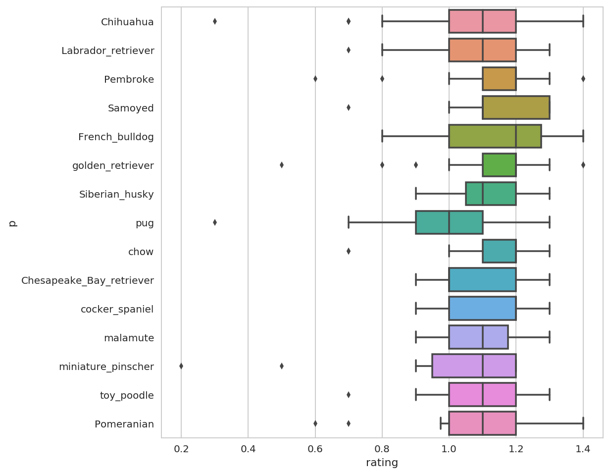
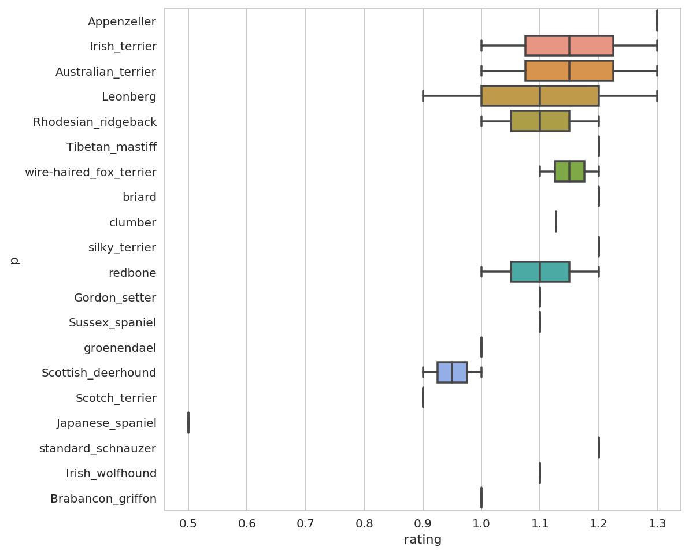
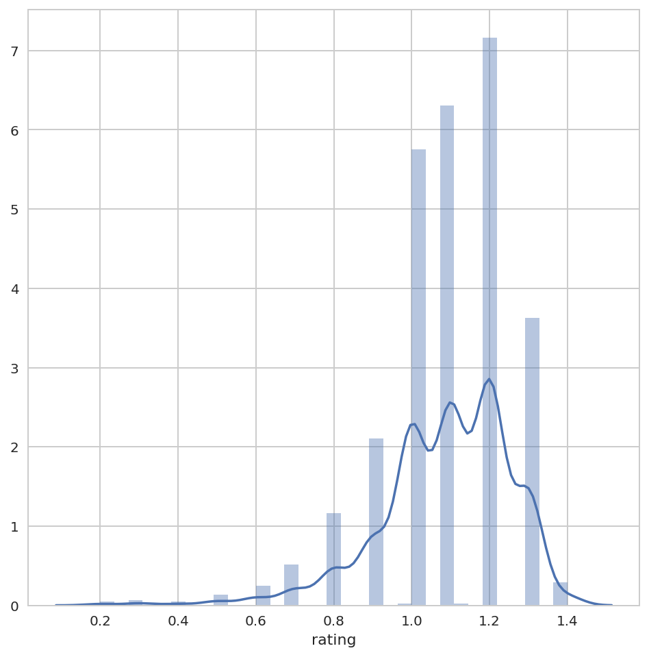
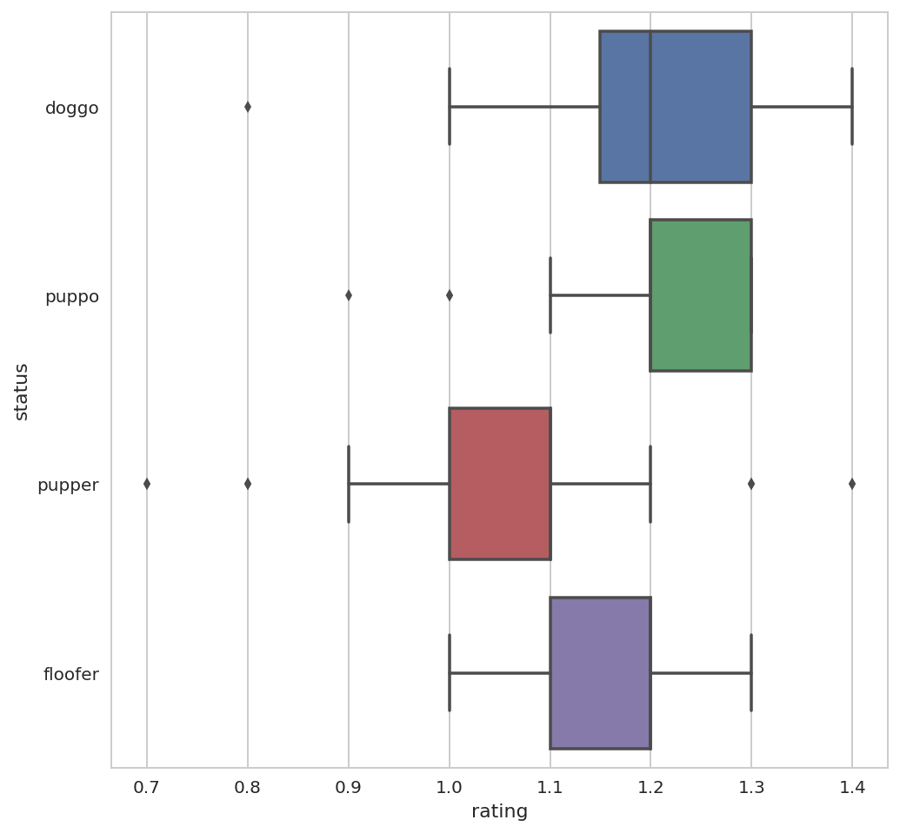

# Act Report
##### UDA-DAND-PROJECT-2-DATA_WRANGLE
---
根据对于推特上关于狗狗评分的分析，我们得出以下的几点结论:

## 结论1：喜爱数与转发数成正相关关系

* 1-1评分数与转发数大体成正相关关系 相关系数R-squared达到0.855
* 1-2大约30%标识喜欢的读者，会转发一次推文

```

                                OLS Regression Results                            
    ==============================================================================
    Dep. Variable:          retweet_count   R-squared:                       0.855
    Model:                            OLS   Adj. R-squared:                  0.855
    Method:                 Least Squares   F-statistic:                     7241.
    Date:                Tue, 03 Apr 2018   Prob (F-statistic):               0.00
    Time:                        13:40:54   Log-Likelihood:                -10785.
    No. Observations:                1229   AIC:                         2.157e+04
    Df Residuals:                    1227   BIC:                         2.158e+04
    Df Model:                           1                                         
    Covariance Type:            nonrobust                                         
    ==================================================================================
                         coef    std err          t      P>|t|      [0.025      0.975]
    ----------------------------------------------------------------------------------
    Intercept       -224.8620     56.971     -3.947      0.000    -336.633    -113.091
    favorite_count     0.3138      0.004     85.092      0.000       0.307       0.321
    ==============================================================================
    Omnibus:                     1194.006   Durbin-Watson:                   1.364
    Prob(Omnibus):                  0.000   Jarque-Bera (JB):           147714.683
    Skew:                           4.140   Prob(JB):                         0.00
    Kurtosis:                      56.066   Cond. No.                     1.97e+04
    ==============================================================================

    Warnings:
    [1] Standard Errors assume that the covariance matrix of the errors is correctly specified.
    [2] The condition number is large, 1.97e+04. This might indicate that there are
    strong multicollinearity or other numerical problems.

```



## 结论2： 最受欢迎的狗狗名字
* 2-1 Tucker、Lucy、Charlie、Cooper、Penny、Oliver是起的最多的Top5名字。





## 结论3：哪些品种最受欢迎
* 3-1 Chihuahua作为最受欢迎的品种位列评论数第一，但是其评分比较分散，喜欢的人很喜欢，不喜欢的人也很不喜欢，以至于其得分均值并不高
* 3-2 French Bulldog（法国斗牛犬）是评分均值最高的品种
* 3-3 可以看到总体上讲养的越多的品种得分越趋向于较高得分





## 结论4：
* 4-1 大多数人的评分都集中在1.0~1.2之间。
* 4-2 整体的评分分布是左偏的，评分均值偏高的方向，大家对于狗狗的评分都趋向打高分



## 结论5：
* 5-1 doggo是最受欢迎的狗的地位
* 5-2 pupper是最不受欢迎的狗的地位
* 5-3 而以上两种狗的地位的评分分布都非常的分散



